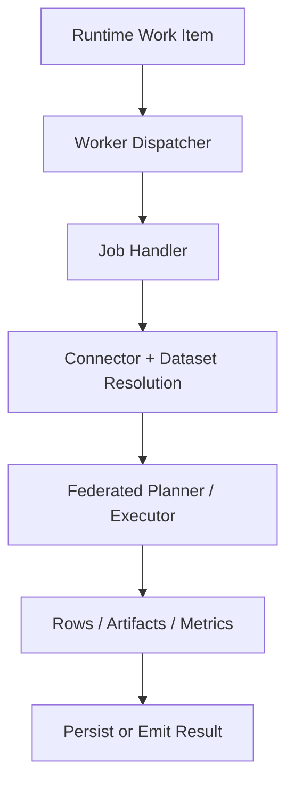

# Execution Plane

The execution plane is where Langbridge workloads actually run.

In this repository, that means the runtime worker plus the runtime services it
uses to resolve datasets, instantiate connectors, execute queries, and produce
result payloads.

## Responsibilities

- consume runtime work items or jobs
- resolve datasets, connectors, and secrets
- execute semantic and SQL workloads
- run federated planning and execution
- enforce runtime limits, retries, and guardrails
- persist or emit result payloads and execution metadata

## Main Components

- worker runtime: `langbridge/apps/runtime_worker/main.py`
- message dispatcher: `langbridge/apps/runtime_worker/handlers/dispatcher.py`
- SQL job handler: `langbridge/apps/runtime_worker/handlers/query/sql_job_request_handler.py`
- semantic query handler: `langbridge/apps/runtime_worker/handlers/query/semantic_query_request_handler.py`
- dataset job handler: `langbridge/apps/runtime_worker/handlers/query/dataset_job_request_handler.py`
- federated tool integration: `langbridge/packages/runtime/execution/federated_query_tool.py`

## Execution Modes

- **Embedded runtime**: execution happens in-process through runtime packages
- **Local worker**: execution happens in a local runtime worker process
- **Self-hosted runtime**: execution happens in customer-managed infrastructure
- **Hybrid runtime**: execution happens in customer-managed infrastructure while integrating with external orchestration systems

## Worker Lifecycle

