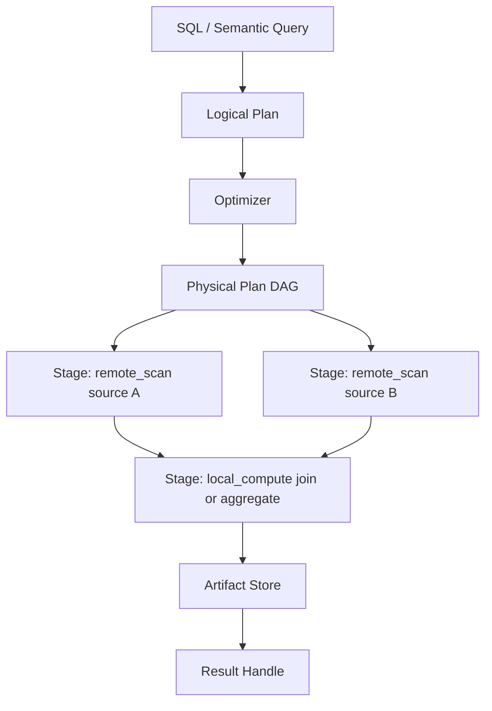

# Federated Query Engine

The Federated Query Engine is Langbridge's primary structured data engine.

It consumes normalized dataset execution descriptors as the main structured input
abstraction, whether the underlying source is:

- a database table
- a file-backed dataset
- a parquet-backed sync
- a virtual dataset

## Engine Components

- service facade: `langbridge/packages/federation/service.py`
- planner: `langbridge/packages/federation/planner/planner.py`
- SQL parsing and semantic compilation:
  - `langbridge/packages/federation/planner/parser.py`
  - `langbridge/packages/federation/planner/smq_compiler.py`
- optimizer: `langbridge/packages/federation/planner/optimizer.py`
- physical planner: `langbridge/packages/federation/planner/physical_planner.py`
- scheduler and executor:
  - `langbridge/packages/federation/executor/scheduler.py`
  - `langbridge/packages/federation/executor/stage_executor.py`
  - `langbridge/packages/federation/executor/artifact_store.py`

## Query Lifecycle

1. A SQL or semantic query enters the runtime.
2. Runtime services resolve dataset descriptors and source bindings.
3. The planner builds a logical plan and optimized physical stage DAG.
4. The scheduler executes remote and local stages with retry and artifact reuse.
5. Result rows, artifacts, stage metrics, and stats are returned.

## Federated Execution DAG

