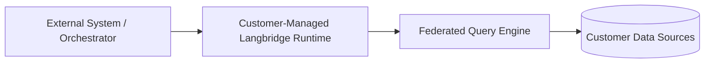

# Hybrid Deployment

Hybrid deployment means the Langbridge runtime executes inside customer-managed
infrastructure while still integrating with external systems for orchestration,
metadata, or triggering.

## Why Hybrid Exists

Hybrid deployment is useful when:

- data access must remain inside a customer network
- execution needs to happen close to source systems
- organizations want to keep runtime operations under their own control
- orchestration and execution need to be separated cleanly

## Runtime Topology

## Design Rules

- runtime execution stays inside customer-managed infrastructure
- connector credentials and source access stay on the runtime side
- integration with external systems should use explicit contracts
- runtime behavior should remain the same across local, self-hosted, and hybrid deployments
