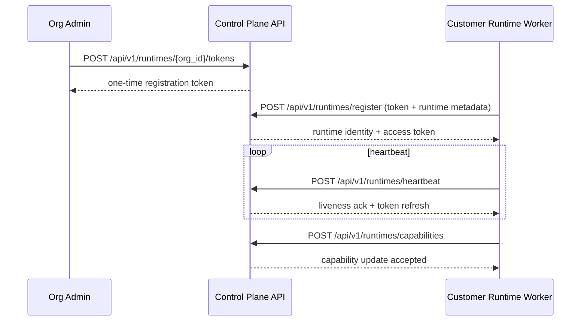
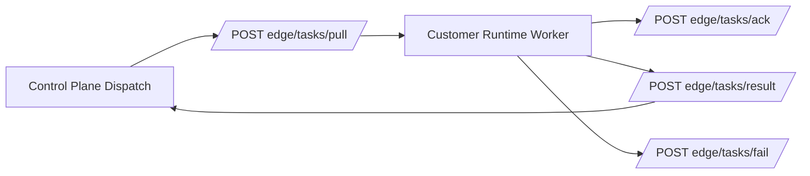

# Hybrid Deployment Architecture

Langbridge supports hybrid deployment by separating control and execution planes.

## Deployment Modes

- **Hosted**: control plane + worker runtime are hosted by Langbridge.
- **Hybrid**: control plane hosted; worker runtime runs in customer network.
- **Self-hosted**: control + execution planes run in customer-managed infrastructure.

## Runtime Registration Flow

## Edge Task Transport Flow

## Security and Isolation

- Runtime registration tokens are one-time and scoped.
- Runtime principals are authenticated for heartbeat/capability/task transport.
- Task routing is organization-aware and capability-aware.
- Results ingestion is idempotent through request IDs and payload hashing.
