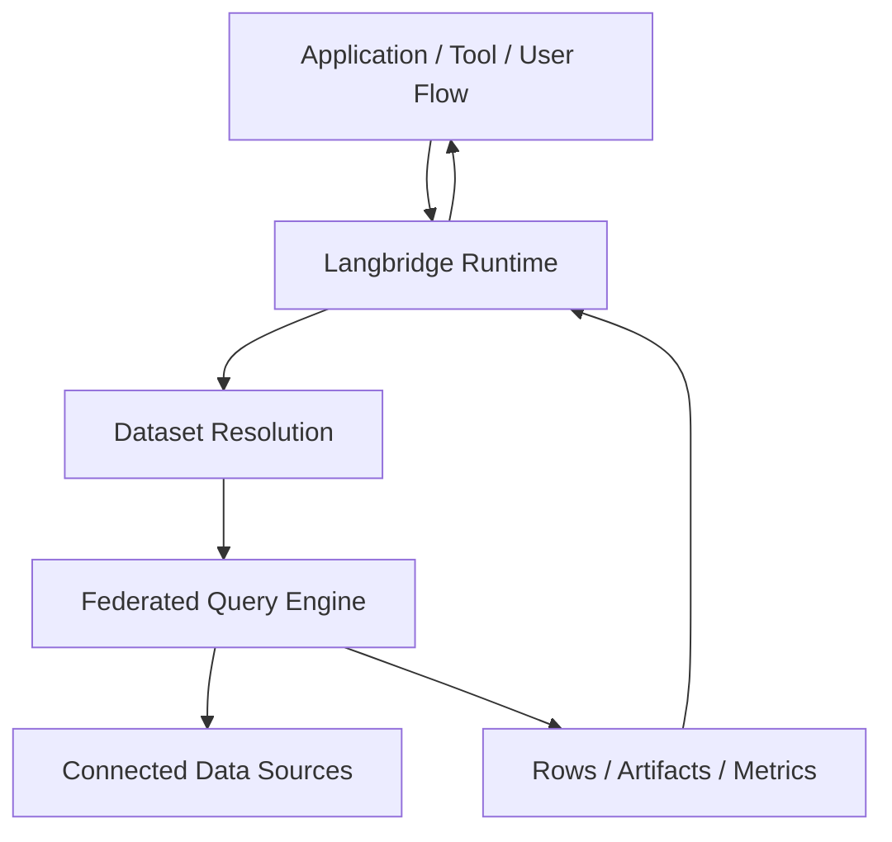

# Architecture Overview

Langbridge is a runtime for connecting data sources to semantic, analytical,
and agent-style execution.

The runtime is organized around four main concerns:

- **Connectors**: adapters for databases, warehouses, files, and APIs
- **Datasets**: normalized structured data contracts over those sources
- **Execution Runtime**: worker and runtime services that execute jobs and tasks
- **Federated Engine**: planner and executor for cross-source structured workloads

## Primary Runtime Flow

## Core Principles

- Data should remain usable where it already lives.
- The runtime should work locally, embedded, self-hosted, and in hybrid deployments.
- Semantic, SQL, and agent workloads should share the same execution substrate where possible.
- Connectors and runtime capabilities should be reusable as packages, not only app code.

## Related Docs

- `docs/architecture/execution-plane.md`
- `docs/architecture/federated-query-engine.md`
- `docs/architecture/hybrid-deployment.md`
- `docs/architecture/runtime-boundary.md`
