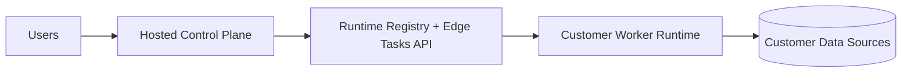

# Hybrid Deployment

Hybrid mode keeps Control Plane hosted while Execution Plane runs inside customer infrastructure.

## Topology

## Setup Steps

1. Configure control plane runtime auth:
   - `EDGE_RUNTIME_JWT_SECRET`
2. Create a runtime registration token:
   - `POST /api/v1/runtimes/{organization_id}/tokens`
3. Start customer worker with:
   - `WORKER_EXECUTION_MODE=customer_runtime`
   - `EDGE_API_BASE_URL=<control-plane>/api/v1`
   - `EDGE_REGISTRATION_TOKEN=<one-time-token>`
4. Worker registers and starts pulling tasks from edge task endpoints.

## Edge Task Endpoints

- `POST /api/v1/edge/tasks/pull`
- `POST /api/v1/edge/tasks/ack`
- `POST /api/v1/edge/tasks/result`
- `POST /api/v1/edge/tasks/fail`

## Runtime APIs

- `POST /api/v1/runtimes/register`
- `POST /api/v1/runtimes/heartbeat`
- `POST /api/v1/runtimes/capabilities`
- `GET /api/v1/runtimes/{organization_id}/instances`
