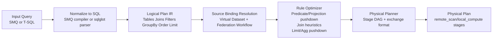
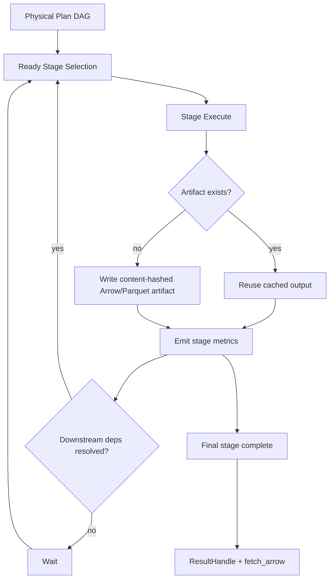
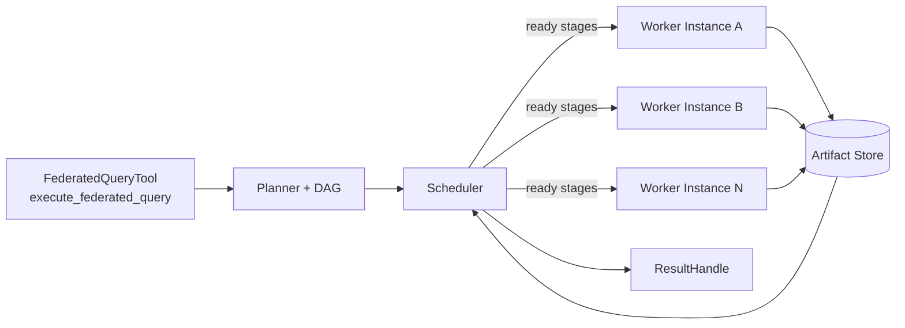

# Federated Query Engine (Worker Data Plane)

## Language choice (v1)
Langbridge v1 federation is implemented in **Python** to minimize integration friction with the existing Worker runtime, connector stack, and DI wiring.

Why Python for v1:
- Worker execution plane is already Python/async.
- Existing connector implementations (Postgres/Snowflake/etc.) are Python `SqlConnector` classes.
- Semantic query compiler already exists in Python (`SemanticQueryEngine`).
- Fastest path to production with low operational complexity.

Embedded local compute engine:
- **DuckDB** for local/federated relational operators.
- **Apache Arrow** (`pyarrow`) for intermediate exchange and artifact serialization.

v2 upgrade path:
- Keep planner/IR contracts stable and swap local execution backend with Rust DataFusion via gRPC or Python bindings for stronger vectorized/distributed runtime scaling.

## Planner flow

## Execution DAG lifecycle

## Distributed worker scheduling

## Internal API contract
- `FederatedQueryService.execute(query: Union[SMQQuery, str], dialect="tsql", workspace_id=...) -> ResultHandle`
- `FederatedQueryService.fetch_arrow(result_handle) -> pyarrow.Table`
- `FederatedQueryService.explain(query, dialect="tsql", workspace_id=...) -> logical + physical plan`

## Worker tool entrypoint
- `langbridge/apps/worker/langbridge_worker/tools/federated_query_tool.py`
- entrypoint method: `execute_federated_query(query_payload)`

Expected payload fields:
- `workspace_id`
- `query` (SMQ object or SQL string)
- `dialect` (default `tsql`)
- `workflow` (`FederationWorkflow`: virtual dataset tables + source bindings + planning knobs)
- `semantic_model` (required for SMQ)

## At-least-once semantics and idempotency
- Stage outputs are persisted through a content-hash artifact key.
- Stage manifest path is deterministic per `(workspace_id, plan_id, stage_id)`.
- Retries reuse cached stage artifacts when manifest is present.
- Scheduler retries failed stages up to configured `retry_limit`.

## Observability emitted per stage
- runtime ms
- rows written
- bytes written
- source elapsed ms (remote scans)
- attempt count
- cache hit indicator

## Local development
- Federation artifact path env: `FEDERATION_ARTIFACT_DIR`
- Optional planner knobs:
  - `FEDERATION_BROADCAST_THRESHOLD_BYTES`
  - `FEDERATION_PARTITION_COUNT`
  - `FEDERATION_STAGE_MAX_RETRIES`
  - `FEDERATION_STAGE_PARALLELISM`
- Optional compose profile for two isolated Postgres sources:
  - `docker compose --profile federation-sources up federation-db-a federation-db-b`
